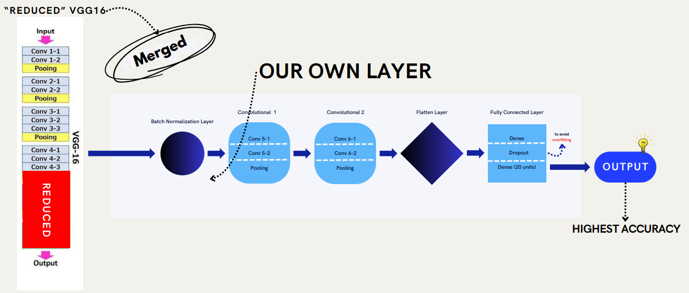
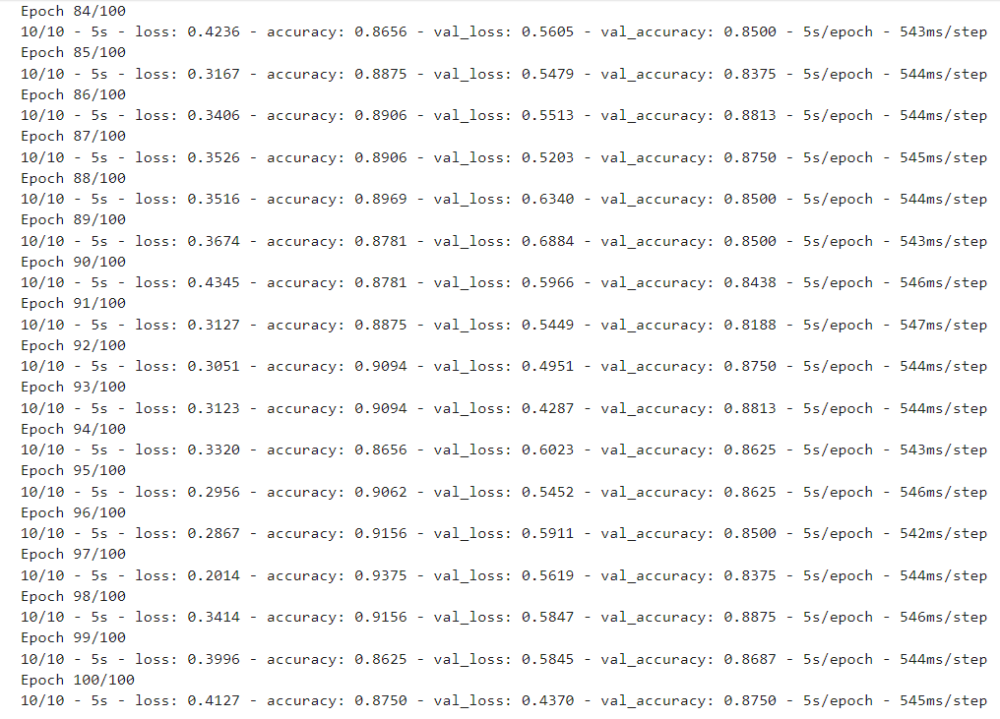
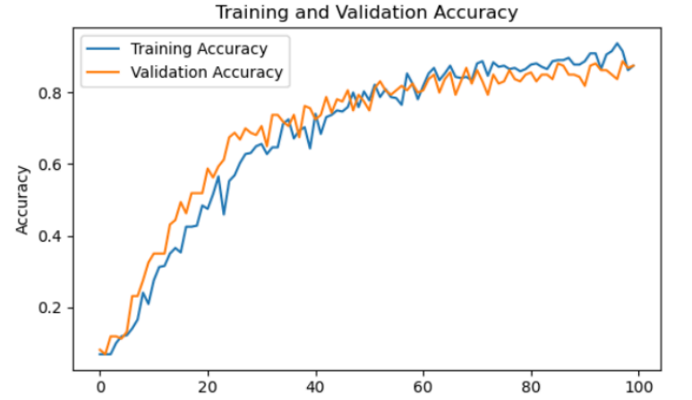

# Identifikasi Motif Batik Menggunakan Foto
`(Bagian Data & Model Machine Learning)`

Proyek ini merupakan proyek bersama yang bertujuan untuk mengidentifikasi motif batik berdasarkan foto. Aplikasi akan dijalankan pada Android menggunakan Kotlin, sedangkan bagian yang saya kerjakan berfokus pada pengolahan data dan pembuatan model Machine Learning.

## Ruang Lingkup Pekerjaan
Peran saya dalam proyek ini meliputi:
- Mencari dan mempersiapkan data
- Pembuatan dan pelatihan model CNN
- Evaluasi Model
- Konversi model agar dapat digunakan di aplikasi Android

## Tahapan Pembuatan Model

### 1. Download dan Persiapan Dataset

Dataset gambar dari motif batik didapatkan melalui [Kaggle](https://www.kaggle.com/datasets/hendryhb/batik-nusantara-batik-indonesia-dataset). 
Setiap gambar batik dikelompokkan berdasarkan motifnya dan dibagi menjadi data training dan validation.

> Total data berjumlah 1600 images yang terdiri dari 40 raw images per motif dengan 224 x 224 yang di-upload oleh user [HendryHB](https://www.kaggle.com/hendryhb).  

`Terdpapat 20 motif, yaitu 'Aceh PintuAceh', 'Bali Barong', 'Bali Merak', 'DKI OndelOndel', 'JawaBarat Megamendung', 'JawaTimur Pring', 'Kalimantan Dayak', 'Lampung Gajah', 'Madura Mataketeran', 'Maluku Pala', 'NTB Lumbung', 'Papua Asmat', 'Papua Cendrawasih', 'Papua Tifa', 'Solo Parang', 'SulawesiSelatan Lontara', 'SumateraBarat Rumah Minang', 'SumateraUtara Boraspati', 'Yogyakarta Kawung', and 'Yogyakarta Parang'`

### 2. Pembuatan Model
#### 2.1 Preparation (Preprocessing & Augmentasi)
Pada tahap ini dilakukan:
- Preprocessing gambar menggunakan ImageDataGenerator
- Data augmentasi seperti rotasi, zoom, dan flipping
Tujuannya adalah untuk mengurangi overfitting dan membuat model lebih robust terhadap variasi gambar.

#### 2.2 Arsitektur Model
##### **2.2.1 Transfer Learning Preparation**
Model menggunakan teknik Transfer Learning dengan memanfaatkan pre-trained model VGG16.
- Alasan memilih VGG16:
- Arsitekturnya relatif sederhana
- Cocok untuk klasifikasi gambar

Dengan memanfaatkan teknik Transfer Learning proses pengembangan model menjadi lebih cepat dan meningkatkan akurasi

##### **2.2.2 Pembuatan Model**
Beberapa layer terakhir dari VGG16 dikurangi.
Setelah mencoba beberapa arsitektur, **hasil terbaik diperoleh dengan menghapus 6 layer terakhir**, yang menghasilkan akurasi paling tinggi.

    

##### **2.2.3 Traning Model**
Model kemudian dilatih menggunakan data training dan divalidasi menggunakan data validation untuk melihat performa model.

    

#### 2.3 Visualisasi Akurasi
Grafik akurasi dan loss dari data training dan validation ditampilkan untuk mengevaluasi performa model selama proses training.

    

### 3. Konversi Model ke TensorFlowJS
Setelah model selesai dilatih, model dikonversi ke format TensorFlow JS agar dapat digunakan pada aplikasi Android.

### 4. Pengujian Model Secara Manual
Model diuji secara manual dengan mengunggah gambar ikan untuk memastikan hasil klasifikasi sudah sesuai.
1. Buka file notebook `Capstone_ML_Model_v3.ipynb`
2. Pada Bar Kiri, klik `Table of Contents`
3. Klik bagian `Testing our model`
5. Lalu run 2 cells yang berada di bagian `Testing our model` 
6. Pada cell kedua, klik `Choose Files` untuk mengirim image dari motif batik yang ingin kita ketahui jenisnya
7. Hasilnya, model akan menunjukan jenis motif beserta persentase confidence-nya